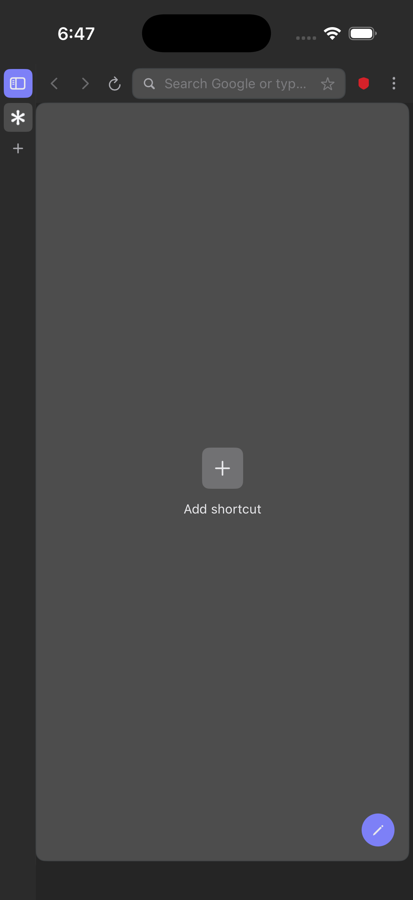
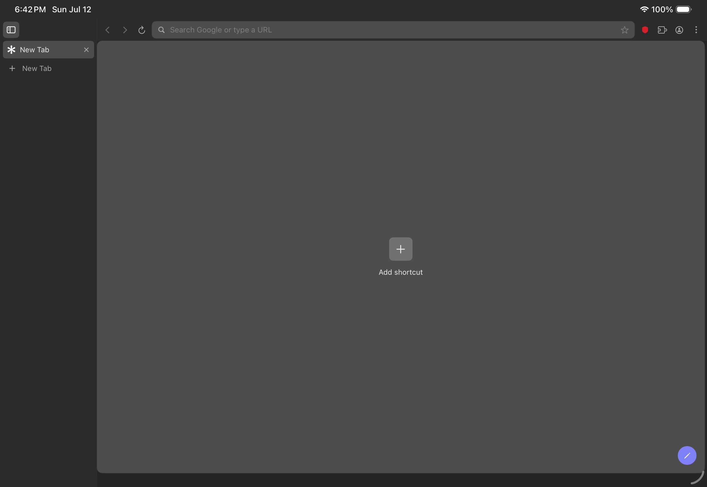
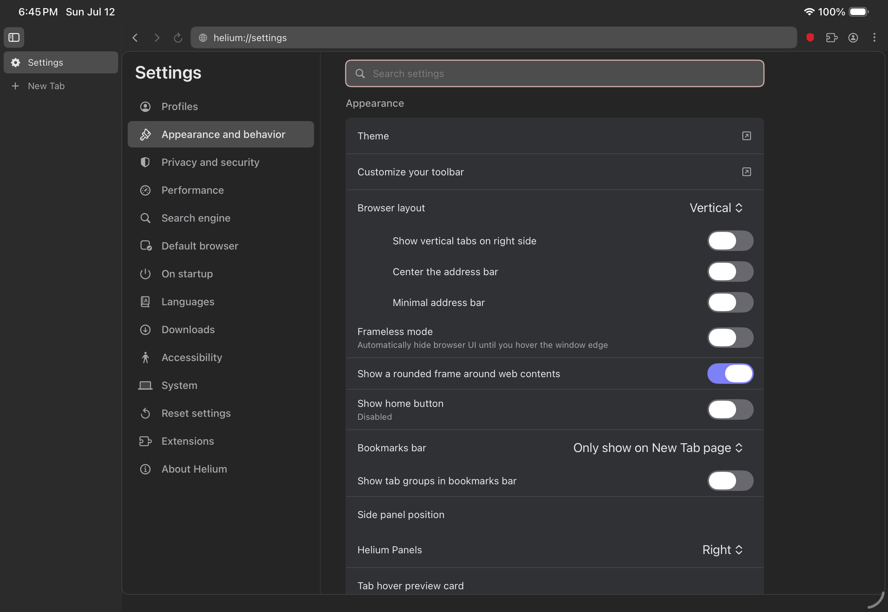
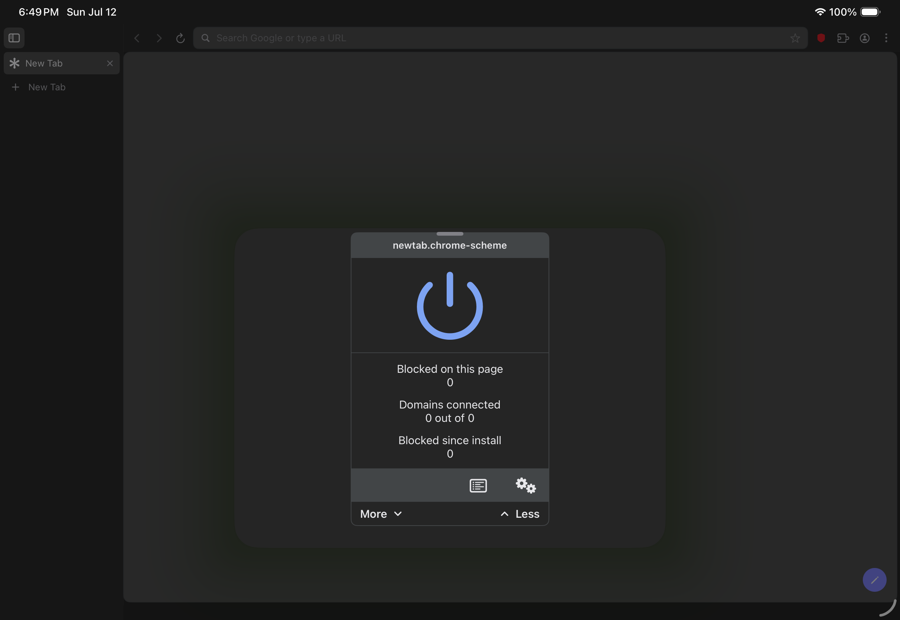

# Helium for iPhone and iPad

An **unofficial community port** of the Helium browser experience, rebuilt in SwiftUI for iOS and iPadOS. Its dark vertical-tab shell, compact omnibox, new-tab page, settings, and blocker panel are matched directly against the desktop Helium app while using Apple's supported WebKit engine.

> This project is not created, reviewed, or endorsed by imput LLC or the official Helium project. “Helium” and the upstream mark identify the intended compatibility port. Get written brand permission or rename the app before an App Store release.

| iPhone | iPad |
| --- | --- |
|  |  |

| Settings | Shields |
| --- | --- |
|  |  |

## What works

- Adaptive Helium vertical tabs: expanded desktop-style rail on wide iPads, collapsed rail and slide-out drawer on iPhone and compact iPad windows
- Dark Chromium-density toolbar, rounded web-content frame, empty Helium new-tab state, and embedded `helium://settings` surface
- Multiple persistent tabs and non-persistent private tabs
- iPad two-page split view
- Address/search field with HTTPS-first navigation and common local `!bangs`
- WebKit content-rule blocker for ads, trackers, cookie banners, and tracking cookies
- Per-site Shields override, standard/aggressive modes, script blocking, and fingerprint hardening
- Bookmarks, local history, search-engine choice, share sheet, and find/reload/back/forward basics
- No analytics, accounts, first-party ads, or Google service dependency
- Privacy manifest, core tests, and a ready-to-enable GitHub Actions simulator-build template

## Engine choice

The worldwide build uses `WKWebView`. Apple App Review Guideline 2.5.6 requires WebKit for ordinary browser apps. Apple allows alternative engines only through special regional entitlements (currently the EU and, with different limits, Japan), and Chromium documents iOS Blink as experimental/analysis-only.

For that reason, Blink is **not** hidden behind a fake setting in this project. A real Blink edition would require a separate BrowserEngineKit host plus rendering, networking, and content extensions; Apple approval; an engine security program; and region-specific distribution. See [ENGINE.md](ENGINE.md) for the practical path.

## Build

Requirements: macOS, Xcode 16 or newer, and [XcodeGen](https://github.com/yonaskolb/XcodeGen).

```sh
brew install xcodegen
xcodegen generate
open Helium.xcodeproj
```

Choose the `Helium` scheme and an iPhone or iPad simulator. Set your development team before installing on a physical device.

If command-line tools are selected instead of Xcode:

```sh
DEVELOPER_DIR=/Applications/Xcode.app/Contents/Developer \
  xcodebuild -project Helium.xcodeproj -scheme Helium \
  -destination 'generic/platform=iOS Simulator' CODE_SIGNING_ALLOWED=NO build
```

Run the platform-independent tests with:

```sh
DEVELOPER_DIR=/Applications/Xcode.app/Contents/Developer xcrun swift test
```

The checked-in `HeliumUITests` target verifies the vertical-tab shell, settings route, and Shields panel on an iPad simulator.

`Config/ios-ci.yml.example` can be copied to `.github/workflows/ios.yml` to enable the included CI checks. GitHub credentials need `workflow` scope for that path.

## Default-browser entitlement

Apple separately approves the `com.apple.developer.web-browser` entitlement. After Apple grants it for your App ID, copy the keys from `Config/DefaultBrowser.entitlements.example` into a real entitlements file, add it to the target's code-signing settings, and register the required HTTP/HTTPS URL schemes. Do not add the entitlement to an unapproved signing profile.

## Privacy model

Block rules are compiled on-device by `WKContentRuleListStore`. Private tabs use `WKWebsiteDataStore.nonPersistent()`. Settings and the small built-in filter set live on-device. Browsing history is never written for private tabs.

This is a useful privacy baseline, not a claim of feature parity with Brave's native engine-level Shields or the official desktop Helium/uBlock fork. A production blocker should add signed, regularly updated public filter lists and regression tests.

## License and upstream

This repository is GPL-3.0-only to remain compatible with Helium's licensing direction. Helium-specific upstream code is GPL-3.0, while imported Chromium portions retain their original licenses. This repository is a clean Swift reimplementation and does not include Chromium or upstream Helium source.

- Official Helium: <https://github.com/imputnet/helium>
- Official site: <https://helium.computer/>
- Helium brand guidance: <https://helium.computer/brand>
- Apple browser-engine requirements: <https://developer.apple.com/support/alternative-browser-engines/>
